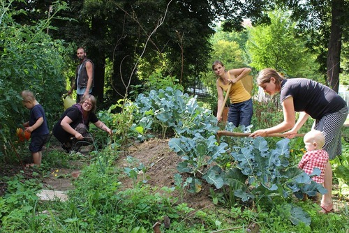

Der Gemeinschaftsgarten "Wilde Linde" ist ein soziales und ökologisches Projekt des [Werkstadthauses](https://www.werkstadthaus.de/), gestartet in 2015. Es wird von der [Anstiftung](https://anstiftung.de/) gefördert.

Bei uns können Kinder, Jugendliche und Erwachsene, interessierte Laien, passionierte Gärtner und Freiluftenthusiasten -- mit drei Worten: alle, die wollen -- gemeinsam mit uns lernen, wie man lokal Lebensmittel anbaut.

Der Gemeinschaftsgarten Wilde Linde ist ein lebendiger Nutzgarten. Es wird gemeinschaftlich gegärtnert und der Boden nachhaltig bewirtschaftet. Einige Berichte unseres Tuns und Pläne für die Zukunft findest Du in unseren [Dokumenten](docs).  

Interesse? Gerne kannst du die Gärtnernden im Garten direkt ansprechen oder du schreibst eine Mail an [wildelinde@werkstadthaus.de](mailto:wildelinde@werkstadthaus.de).

## Termine

Von Frühjahr bis Herbst treffen wir uns **jeden Dienstag ab 15 Uhr und jeden Freitag ab 15:30** Uhr auf dem Gelände.

## Lage

Der Geminschaftsgarten befindet sich in der Jahnallee [zwischen dem Wildemuthgymnasium und dem 3-in-One Bewegungspark](https://www.google.de/maps/place/48.515424+9.046746/@48.5154661,9.0471768,212m/data=!3m1!1e3) nahe der [alten Lindenallee](http://www.tuepedia.de/index.php/Alte_Lindenallee). Weithin sichtbar ist zudem der Bauwagen am Rande des Gemeinschaftsgartens.

